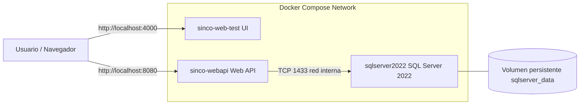

# SincoWebInfra

Infraestructura local de Sinco basada en Docker Compose con:

- SQL Server 2022
- API (`asmonsalves42/sinco-webapi:1.0.0`)
- UI (`asmonsalves42/sinco-web:1.0.0`)

## 1) Arquitectura

La solución corre en una red Docker única (red por defecto de Compose) y usa volumen persistente para SQL Server.



### Servicios

- `sqlserver`
	- Imagen: `mcr.microsoft.com/mssql/server:2022-latest`
	- Puerto host: `1439` -> contenedor `1433`
	- `healthcheck` con `sqlcmd` para validar disponibilidad real.
	- Volumen persistente: `sqlserver_data`.

- `webapi`
	- Imagen: `asmonsalves42/sinco-webapi:1.0.0`
	- Puerto host: `8080`.
	- Espera a SQL Server saludable con `depends_on: condition: service_healthy`.
	- Connection string interna: `Server=sqlserver,1433;...`.

- `ui`
	- Imagen: `asmonsalves42/sinco-web:1.0.0`
	- Puerto host: `4000`.
	- Variables:
		- `PORT=4000`
		- `API_TARGET_URL=http://host.docker.internal:7041`

> Nota: actualmente UI apunta a una API en `host.docker.internal:7041` (host). Si quieres que UI consuma la API de este mismo Compose, cambia a `http://webapi:8080`.

---

## 2) Estructura del proyecto

```txt
SincoWebInfra/
├─ docker-compose.yml
├─ .env
└─ README.md
```

---

## 3) Requisitos

- Docker Desktop instalado y corriendo.
- Docker Compose v2 (`docker compose version`).
- Puertos libres en host:
	- `1439` (SQL)
	- `8080` (API)
	- `4000` (UI)

---

## 4) Configuración de variables

Archivo `.env`:

```env
MSSQL_SA_PASSWORD=Admin123456!
```

### Reglas de contraseña de SQL Server

Debe cumplir complejidad (mayúscula, minúscula, número y símbolo, longitud mínima).

---

## 5) Cómo ejecutar la solución

### Levantar todo

```bash
docker compose up -d
```

### Validar estado

```bash
docker compose ps
```

### Ver logs

```bash
docker compose logs -f sqlserver webapi ui
```

### Accesos

- UI: `http://localhost:4000`
- API: `http://localhost:8080`
- SQL Server: `localhost,1439` (usuario `sa`)

---

## 6) Orden de arranque y disponibilidad

1. `sqlserver` inicia.
2. `healthcheck` de SQL valida conexión con `SELECT 1`.
3. Cuando SQL está `healthy`, Docker crea/inicia `webapi`.
4. `ui` inicia de forma independiente.

Esto evita que la API inicie antes de que SQL acepte conexiones.

---

## 7) Migraciones EF

La migración ahora se ejecuta dentro del arranque de la API (no por servicio `migrator` en Compose).

Recomendación en la API:

- Ejecutar `Database.Migrate()` / `Database.MigrateAsync()` en startup.
- Mantener reintentos de conexión para tolerar arranque en frío de SQL.

---

## 8) Troubleshooting

### Error de login `sa` (18456, State 8)

Síntoma típico en logs de SQL:

- `Login failed for user 'sa'. Reason: Password did not match...`

Causa común:

- Se cambió `MSSQL_SA_PASSWORD` en `.env` después de inicializar el volumen `sqlserver_data`.

Opciones de solución:

1. **Mantener datos existentes**: usar en `.env` la misma contraseña con la que se creó originalmente el volumen.
2. **Reinicializar desde cero** (borra datos):

```bash
docker compose down -v
docker compose up -d
```

### API no arranca

- Verifica estado de SQL: `docker compose ps`
- Revisa logs: `docker compose logs -f sqlserver webapi`
- Confirma connection string de `webapi` apunta a `sqlserver,1433`.

### UI no consume la API esperada

- Hoy está configurada con `API_TARGET_URL=http://host.docker.internal:7041`.
- Si quieres usar la API de este stack, cambiar a `http://webapi:8080`.

---

## 9) Operación diaria

### Detener servicios

```bash
docker compose down
```

### Reiniciar servicios

```bash
docker compose restart
```

### Re-crear servicios por cambios en variables/imágenes

```bash
docker compose up -d --force-recreate
```

---

## 10) Seguridad y buenas prácticas

- No subir `.env` con secretos reales al repositorio.
- Usar una contraseña robusta para `sa` en ambientes compartidos.
- Para producción, usar un gestor de secretos y TLS extremo a extremo.
